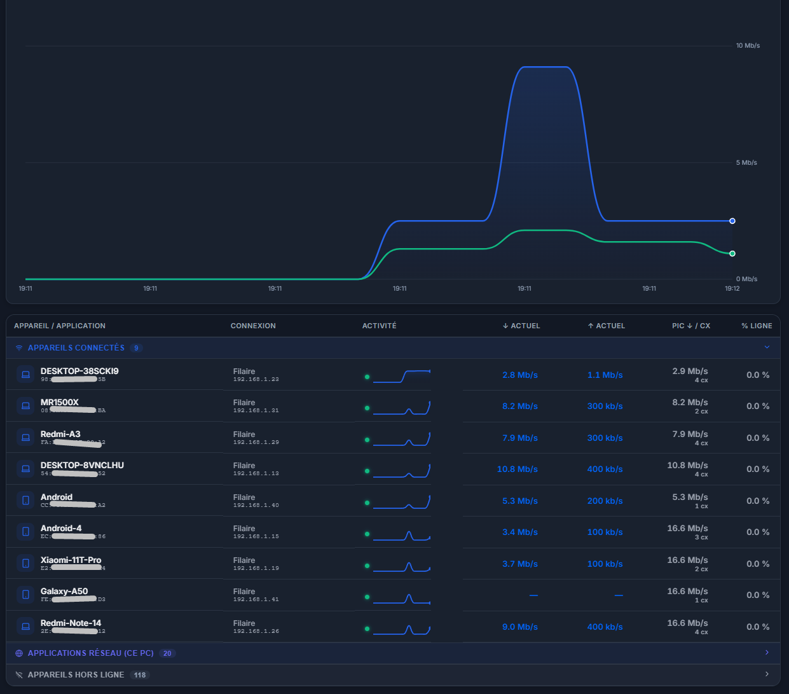

# Freenekit 📡 — Monitoring Réseau & Freebox pour Windows

[](https://www.paypal.com/paypalme/msdos10)

> 💙 **Soutenir le développement** : Si Freenekit vous est utile au quotidien, vous pouvez soutenir le projet et le maintien des futures mises à jour via PayPal : **[Faire un don sur PayPal (paypalme/msdos10)](https://www.paypal.com/paypalme/msdos10)**

---

**Freenekit** est une application desktop Windows moderne et légère conçue pour suivre en temps réel la consommation réseau, le débit Fibre/ADSL, les équipements connectés et les processus réseau de votre PC via l'API Freebox OS.



---

## ✨ Fonctionnalités Principales

- ⚡ **Monitoring en Temps Réel** : Suivi seconde par seconde des débits descendant (Download) et montant (Upload) réels de votre ligne Freebox.
- 💻 **Bande Passante par Processus Windows** : Identification des applications (Google Chrome, Roblox, Discord, Opera, Steam...) et attribution du débit réel selon le nombre de connexions TCP actives.
- 📱 **Appareils Réseau (Wi-Fi & Filaire)** : Détection automatique des smartphones, téléviseurs, consoles et sous-routeurs/points d'accès Wi-Fi avec calcul individuel du débit et du pic d'activité.
- 📶 **Analyse Wi-Fi & Qualité de Signal** : Visualisation de la norme Wi-Fi (Wi-Fi 5/6/7) et de la qualité de connexion des équipements.
- 🛡️ **Système Anti-Intrusion (Alarme MAC)** : Notification Windows native lors de la première connexion d'un nouvel appareil inconnu sur votre réseau.
- 🔀 **Gestionnaire de Ports NAT 1-Click** : Ajout et suppression faciles des redirections de ports (Minecraft, Web HTTP/HTTPS, WireGuard VPN, SSH) sans ouvrir le navigateur.
- 📞 **Journal des Appels Fixes** : Consultation de l'historique complet des appels reçus, manqués et émis sur la ligne fixe de votre Freebox.
- 🔄 **Redémarrage Freebox à Distance** : Redémarrer le Freebox Server en 1 clic directement depuis l'application.
- 📌 **Widget Systray & Thème Auto** : Intégration dans la zone de notification Windows (Systray) et basculement automatique Sombre/Clair synchronisé avec Windows 11.

---

## 🛠️ Modèles Freebox Supportés

Compatible avec toutes les box Freebox OS via l'API universelle (v4 à v16+) :
- **Freebox Ultra** (Wi-Fi 7 / 10 Gbps)
- **Freebox Pop**
- **Freebox Delta**
- **Freebox Révolution**
- **Freebox Mini 4K / One**

---

## 🚀 Installation & Utilisation

### Téléchargement (.exe)
1. Rendez-vous dans la section [Releases](../../releases) du projet.
2. Téléchargez l'archive `Freenekit-Windows-v1.0.0.zip` ou `Freenekit.exe`.
3. Lancez `Freenekit.exe`.

### Développement Local
```bash
# Installez les dépendances
npm install

# Lancez le serveur de développement Vite & Electron
npm run dev

# Compilez le package .exe Windows
npm run package
```

---

## 🔒 Configuration des Droits Freebox OS

Lors du premier lancement :
1. Assurez-vous d'être connecté au même réseau (Wi-Fi ou Ethernet) que votre Freebox.
2. Cliquez sur **"Associer ma Freebox"** et validez la demande sur l'écran tactile/affichage de votre Freebox.
3. Sur l'interface web [mafreebox.freebox.fr](http://mafreebox.freebox.fr) -> *Paramètres* -> *Gestion des accès* -> *Applications*, cochez les autorisations (*Paramètres*, *Réseau local*, *Appels*).

---

## 📚 Documentation Technique & API Freebox

Pour des informations détaillées et approfondies sur les endpoints REST Freebox OS, le processus de découverte réseau (`api_version`), l'authentification HMAC-SHA1 ou la gestion des sessions, vous pouvez consulter la documentation technique complète :

👉 **[Consulter FREEBOX_API_RESEARCH.md](./FREEBOX_API_RESEARCH.md)**

---

## 📄 Licence
Projet sous licence MIT. Développé par MSDOS01 / Discord : therealcopper. Sur une idée de Thibault Henry et son app Mac.
